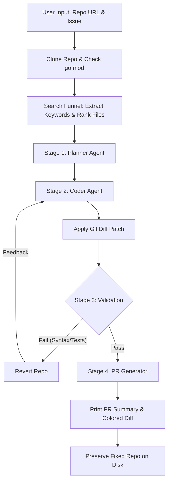

# Agentic PR Builder

An autonomous CLI tool that automatically fixes bugs in Go repositories. Give it a GitHub repository URL and an issue description, and it will clone the repository, locate the bug, write a patch, run tests, and generate a pull request summary.

---

## 🎯 What Types of Issues Can This Solve?
This tool excels at:
- **Localized Logic Bugs**: e.g., Off-by-one errors, conditional mistakes, or nil-pointer dereferences.
- **Test Failures**: Fixing broken tests or implementations that cause test suite regressions.
- **Simple Refactoring**: Renaming variables across files, updating deprecated function calls, or small-scale syntax migrations.

It struggles with:
- **Massive Architectural Rewrites**: It processes chunks of files, so entirely rewriting a repository is out of scope.
- **Proprietary DB/External Dependencies**: If tests require a local PostgreSQL database or specific external API keys, the validation loop will fail to compile/test.

---

## 🚀 Quick Start

### 1. Installation
```bash
git clone https://github.com/thegirlhacker/Autonomous-Go-Code-Repair-Agent-.git
cd Autonomous-Go-Code-Repair-Agent-

# Create and activate virtual environment
python3 -m venv venv
source venv/bin/activate
pip install -r requirements.txt
```

### 2. Configuration
Create a `.env` file in the project root:
```env
GEMINI_API_KEY="your-gemini-api-key"
# Or
OPENAI_API_KEY="your-openai-api-key"
# Or
GROQ_API_KEY="your-groq-api-key"
```

### 3. Usage

**Autonomous Mode (CLI Arguments):**
```bash
python3 main.py --repo https://github.com/gin-gonic/gin --issue "Non-standard X-Forwarded-For header content is not supported"
```

**Interactive Mode:**
```bash
python3 main.py
# The CLI will prompt you to enter the repo URL and issue text.
```

---

## 🧠 System Architecture & Workflow

1. **AST-Like Search Funnel**: Extracts keywords from the issue, greps the repository, and ranks matched Go files using Go symbol/type matching and keyword density.
2. **Planner Agent**: Proposes an investigation and fix strategy.
3. **Coder Agent**: Writes a `git apply`-compatible unified patch.
4. **Self-Healing Validation Loop**: Applies the patch and validates via `go build` and `go test` (auto-downloads a Go toolchain if not installed). If errors occur, the compiler log is fed back to the Coder for automatic correction (up to 3 retries).
5. **PR Generator**: Summarizes changes into a conventional commit format and PR body.

### Workflow Diagram



---

## 📁 File Structure

- `main.py` - CLI entry point.
- `core/` - Orchestrator and agent system prompt templates.
- `tools/` - Internals for search funnel, file/line editing, Git integrations, and Go test runners.
